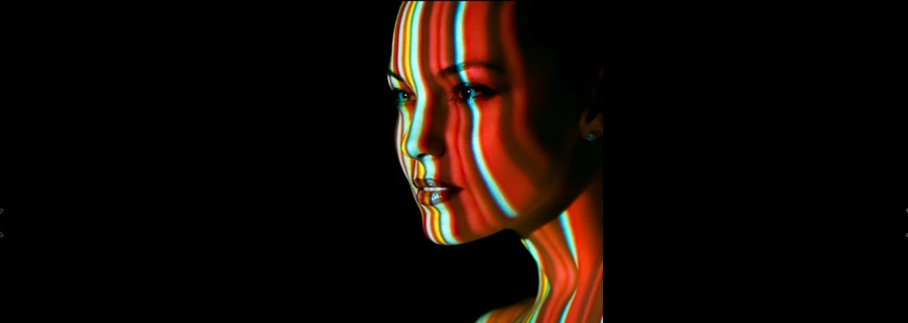
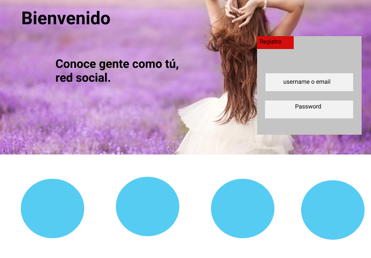
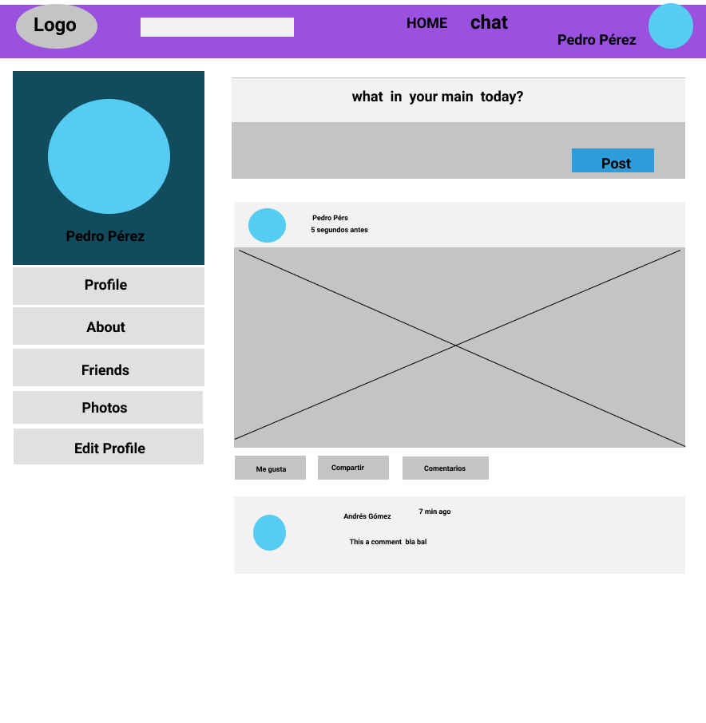

*Red Social**
*SOBRE EL PRODUCTO*

Las redes sociales han invadido nuestra vida, ”Son plataformas basadas en Internet que permiten la interacción entre personas por medio de un perfil individual”

## Cuestión del problema
Espacio en donde personas con intereses en común, en este caso de la fotografía pueden interactuar, anunciar productos necesidades y relacionados a la foto.Y todo lo demás es variable

Propuesta solucion para el problema
Nuestra red social
Nuestra red social _AG Photo fue creada para crecer,  fortalecer la comunicación entre la comunidad de gente que le gusta la fotografía y que la necesita para su trabajo o su vida.

**LOGO**
                                   

**Red Social AG Photo**

*Descripción- objetivos**
AG Photo es una Red Social -de fotografía con accesibilidad vía web y mobile, que tiene como finalidad la interacción de personas con los mismos intereses en la fotografía,
pueden anunciar productos, necesidades y relacionados a la foto.
Los usuarios pueden compartir archivos multimedia como fotos y vídeos y añadir eventos.
Seguramente has visto cómo poco a poco tus amigos, hermanos, familia se han unido poco a poco a las redes sociales y descubrir nuevas personas interesantes de conocer con tus mismos intereses; te invitamos a probar de qué va todo esto compartiendo cosas fascinantes y divertidas.

**PLANEACIÓN DEL PROYECTO**
**Proceso de trabajo
ETAPA USER EXPERIENCE - UX**
Empatizar. Identificar las necesidades, en este caso de usuarios de foto, En un día típico como necesitan de la fotografía. Se hicieron preguntas con posibles expectativas.
Encuestas. Resultados

**Primeras Conclusiones- Segunda etapa Definir**
La gente si tiene contacto entre personas  con la fotografía, les gusta interactuar y si probarían redes nuevas de foto.

Con una investigación más profunda se pudo conocer más de cerca  sus actividades y necesidades como usuarios.
**Idear- Tercera etapa**
Es una red social que se centra en el mundo de la foto y es un punto de encuentro e interacción  para actores, músicos  modelos, fotógrafos, maquilladores, y entusiastas. Cuenta con diferentes muros para todas estas categorías, permite comentar las imágenes, seguir a gente,Además,de que puedes hacer contratos de sesiones fotográficas

**Páginas Webs y Redes Sociales actuales**
PINTEREST
INSTAGRAM
FLICKR
INSPIRE
**Prototipar-Cuarta etapa**

**ETAPA FRONT END**
**Producción**
**Herramientas tecnológicas que se utilizaron**
CSS
JavaScript
JQuery
Boostrap
Html
Fitmap

Evaluar -Quinta etapa
Segundo alcance proximo
